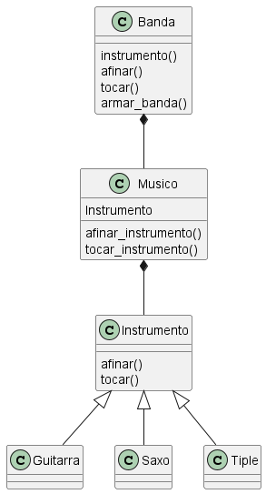

# Banda Aleatoria

## Integrantes:
- Juan David Avila ALvarez 20232020154
- 

## Descripción:

Este programa tiene el fin de generar un banda musical con una cantidad de musicos aleatoria y cada uno con un instrumento aleatorio usando codigo orientado a objetos en el lenguaje de python.

## Diagramas:
__Clases__
